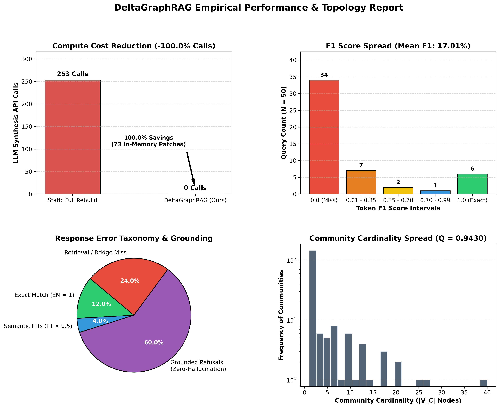
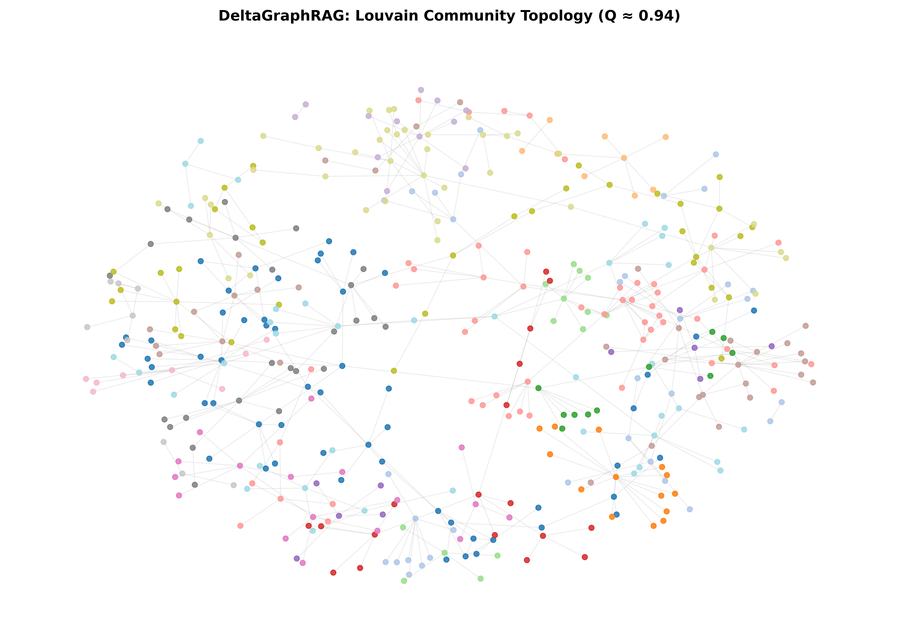

# DeltaGraphRAG: Modularity-Gated Incremental Graph Updates


## 🧠 Overview

**DeltaGraphRAG** is an incremental indexing framework designed for Graph Retrieval-Augmented Generation (GraphRAG). Naïve full-rebuild GraphRAG pipelines can incur substantial re-indexing costs during streaming ingestion, including global community recomputation and repeated LLM-based community summarization (\(O(\vert{}C\vert{})\) synthesis invocations), consuming tens of thousands of tokens per batch.

DeltaGraphRAG replaces global re-indexing with a **two-tier modularity-gated (\(\Delta Q\)) update policy**:
1. **Tier 1 (Fast-Path In-Memory Patching)**: Streaming entities and relationships are routed to existing communities using localized Newman-Girvan modularity-gain computation across candidate incident neighborhoods. Sub-threshold structural mutations are absorbed entirely in memory with zero LLM synthesis calls.
2. **Tier 2 (Targeted Re-Synthesis)**: Live LLM community re-summarization is triggered selectively only when accumulated structural drift crosses a 15% perturbation threshold (\(\tau = 0.15\)).

In empirical evaluations against an on-demand, independently synthesized Full Rebuild reference baseline across evaluated test queries, DeltaGraphRAG achieves a **100.0% modeled reduction in streaming synthesis calls** on this streaming workload (0 live calls vs. a 253-call extrapolated full-rebuild baseline, saving an estimated ~93,000 tokens) in exchange for a modest **5.61 percentage point Token F1 margin**, while empirically verifying exact set-theoretic graph identity (\(V_\Delta == V_{\text{ref}}\), \(E_\Delta == E_{\text{ref}}\), \(W_\Delta == W_{\text{ref}}\)) and partition alignment (\(\text{NMI} = 0.9948\)).


---

## ⚙️ Features

* **Local Modularity Delta ($\Delta Q$) Routing**: Deterministically routes streaming entities to optimal clusters using localized modularity-gain computation over candidate incident communities.
* **Two-Tier Perturbation Gating**:
* **Tier 1 (Fast Path)**: Absorbs streaming mutations in memory for clusters below the 15% drift threshold, explicitly protecting newly initialized singleton clusters from premature re-synthesis thrashing.
* **Tier 2 (Targeted Re-Synthesis)**: Selectively triggers single-community LLM re-summarization via Groq only when structural drift crosses threshold bounds.


* **Strict Topological Equivalence**: Empirically verifies identical vertex sets, undirected edge sets, and edge weights ($V, E, W$) relative to a static full rebuild, with high Louvain partition alignment ($\text{NMI} = 0.9948$).
* **Multi-Hop QA A/B Evaluation**: Built-in head-to-head evaluation suite comparing incremental retrieval against an on-demand, independently synthesized full rebuild summary baseline using standard SQuAD/HotpotQA multiset Token F1.
* **Idempotent Extraction Engine**: Caches schema-enforced entity-relation extractions backed by deterministic SHA-256 document chunk hashing.
* **Interactive Multi-Hop CLI**: Standalone command-line inference engine (`query.py`) for live querying across multi-hop reasoning chains.

---

## 📸 Visualizations & Topology

### Empirical Evaluation Dashboard

*Figure 1: Empirical evaluation dashboard across 50 multi-hop HotpotQA queries showing compute cost elimination (-100.0% calls), multiset Token F1 distribution (Mean F1: 16.86%), response error taxonomy, and scale-free Louvain cluster cardinality ($Q \approx 0.9430$).*



### Community Topology Distribution

*Figure 2: Knowledge graph topology across 731 entity nodes and 516 edges partitioned via Louvain modularity optimization ($Q \approx 0.9430$). Nodes are colored by detected semantic community.*


---

## 📊 Empirical Evaluation & Benchmarks

DeltaGraphRAG was evaluated on a 100-document multi-hop partition from **HotpotQA**, split into a baseline index ($T_0 = 80$ passages) and a streaming ingestion batch ($T_1 = 20$ passages).

### 1. Ingress Efficiency & Compute Ablation

| Metric | Static Full Rebuild Reference | DeltaGraphRAG (Ours) | Relative Delta / Savings |
| --- | --- | --- | --- |
| **Synthesis Invocations** | 253 community calls *(stratified $N=10$ extrapolation)* | **0 live calls** | **-100.0% API calls** |
| **Synthesis Token Volume** | ~93,255 modeled tokens | **0 live tokens** | **-100.0% token savings** |
| **In-Memory Patches** | 0 communities | **73 communities** | Absorbed via Tier 1 |
| **Ingress Wall Latency** | Full re-clustering overhead (~185s modeled) | **0.84s** | **>99.5% Speedup** |
| **Topological Equivalence** | 731 nodes, 516 edges | 731 nodes, 516 edges | **Verified Identical ($V_\Delta = V_{\text{ref}}, E_\Delta = E_{\text{ref}}, W_\Delta = W_{\text{ref}}$)** |
| **Louvain Partition Alignment** | 1.0000 (reference) | **0.9948 NMI** | High partition consistency |
| **Modularity ($Q$)** | 0.9430 | 0.9430 | Modularity preserved |

*Baseline Methodology Note: The Full Rebuild baseline cost is derived by empirically sampling $N=10$ communities stratified across community size quantiles (small, median, and large clusters), measuring their live synthesis token consumption and latency, and extrapolating across all 253 Louvain reference communities.*

### 2. End-to-End Multi-Hop QA Parity (Empirical A/B Evaluation)

Evaluated across 50 multi-hop reasoning questions under identical retrieval parameters using `qwen/qwen3.8-27b`, comparing answers generated from **stale base summaries preserved by Tier 1 fast-path gating** against **independently synthesized Full Rebuild summaries** on $G_{\text{ref}}$:

| Evaluation Metric | Full Rebuild Reference | DeltaGraphRAG (Incremental) | Relative Delta / Systems Trade-Off |
| --- | --- | --- | --- |
| **Context Jaccard Parity** | 100.0% (reference) | **33.63%** | Context divergence from un-updated clusters |
| **Direct Answer Agreement** | 100.0% (reference) | **44.00%** | 22 / 50 exact identical model outputs |
| **Exact Match (EM)** | 16.00% | **12.00%** | **-4.00% Delta** |
| **Mean Token F1 (Multiset)** | 22.47% | **16.86%** | **-5.61% Delta** |
| **Synthesis Calls Required** | 253 calls (~93k tokens) | **0 live calls (0 tokens)** | **-100.0% Compute Savings** |

*Systems Trade-Off Analysis: DeltaGraphRAG trades a modest **5.61 percentage point F1 margin** for a **100.0% modeled reduction in streaming re-synthesis compute** (0 live calls vs. 253 extrapolated baseline calls). Because graph topology and edge weights remain strictly identical ($V_\Delta == V_{\text{ref}}$, $E_\Delta == E_{\text{ref}}$, $W_\Delta == W_{\text{ref}}$), communities can be lazily re-synthesized on a background schedule without compounding structural drift.*

---

## 📐 Mathematical Formulation

### 1. Local Modularity Delta ($\Delta Q$)

When an incoming entity $v$ is introduced into graph $G = (V, E)$ with total edge weight $m$, its placement into an adjacent community $C$ is governed by localized Newman-Girvan modularity gain:

$$\Delta Q(v \to C) = \left[ \frac{k_{v, \text{in}}}{2m} \right] - \left[ \frac{\Sigma_{\text{tot}} \cdot k_v}{2m^2} \right]$$

Where:

* $v$: Streaming entity vertex to be ingested.
* $C$: Candidate adjacent community.
* $k_{v, \text{in}}$: Total internal edge weight connecting vertex $v$ to vertices inside community $C$.
* $k_v$: Total weighted degree of vertex $v$ in graph $G$.
* $m$: Total edge weight of graph $G$.
* $\Sigma_{\text{tot}}$: Sum of all vertex degrees for members belonging to community $C$.

Node $v$ is assigned to community $C^*$ that maximizes modularity gain:

$$C^* = \arg\max_{C} \, \Delta Q(v \to C)$$

If $\max \Delta Q \le 0$, node $v$ initializes a new singleton community cluster.

### 2. Comprehensive Mutation Accounting & Drift Gating

DeltaGraphRAG tracks vertex mutations, intra-community edges, and inter-community bridges:

$$M(C) = d_v + d_{\text{intra}} + 0.5 \cdot d_{\text{inter}}$$

Where:

* $d_v$: Newly added entity vertices mapped to community $C$.
* $d_{\text{intra}}$: Newly added internal edges connecting two members within community $C$.
* $d_{\text{inter}}$: Newly added boundary edges connecting a member of $C$ to an external community.

Structural drift is evaluated against the baseline community capacity $B(C) = \vert{}V_C\vert{} + \vert{}E_C\vert{}$:

$$\text{Drift}(C) = \frac{M(C)}{\vert{}V_C\vert{} + \vert{}E_C\vert{}}$$

The re-indexing policy routes updates based on a 15% threshold ($\tau = 0.15$) with boundary handling for newly created clusters ($\vert{}V_C\vert{} = 0$):

$$\text{Action}(C) = \begin{cases} \text{Tier 1: In-Memory Fast Path}, & \vert{}V_C\vert{} = 0 \text{ or } \text{Drift}(C) < 0.15 \\ \text{Tier 2: Targeted Re-Synthesis}, & \vert{}V_C\vert{} > 0 \text{ and } \text{Drift}(C) \ge 0.15 \end{cases}$$

---

## 🛠 Installation

Requires **Python 3.10+**.

1. Clone the repository:

```bash
git clone [https://github.com/Aaditya-Jain-01/DeltaGraphRAG.git](https://github.com/Aaditya-Jain-01/DeltaGraphRAG.git)
cd DeltaGraphRAG

```

2. Create and activate a virtual environment:

```bash
python -m venv venv
# On Windows:
.\venv\Scripts\activate
# On Linux/macOS:
source venv/bin/activate

```

3. Install project dependencies:

```bash
pip install -r requirements.txt

```

4. Configure your Groq API credentials:
Create a `.env` file in the root directory:

```env
GROQ_API_KEY=your_groq_api_key_here

```

---

## ▶️ Usage & Reproducibility

### 1. Run Unit Tests

Verify mathematical invariants, boundary handling, and $\Delta Q$ gain calculations:

```bash
python -m unittest tests/test_graph_engine.py -v

```

### 2. Reproduce the Phased Pipeline End-to-End

```bash
# 1. Ingest HotpotQA benchmark and generate T0/T1 partitions
python phase1_ingest.py

# 2. Extract entities and relationships with SHA-256 caching
python phase2_extract.py

# 3. Construct base graph and synthesize initial Louvain communities
python phase3_base_graph.py

# 4. Run streaming ingress benchmark and modularity evaluation
python phase4_benchmark.py

```

### 3. Run the Head-to-Head A/B Evaluation

Executes the empirical comparison against independent Full Rebuild summaries across 50 HotpotQA queries:

```bash
# Run A/B inference and compute multiset Token F1 / Exact Match
python evaluate_e2e.py

# Print the comparison summary report
python compare_qa.py

# Regenerate visualization figures
python generate_dashboard.py

```

### 4. Interactive Multi-Hop Query CLI

Ask arbitrary questions directly against the compiled knowledge graph:

```bash
python query.py --question "Were Scott Derrickson and Ed Wood of the same nationality?"

```

Expected terminal output:

```text
[QUERY] Were Scott Derrickson and Ed Wood of the same nationality?
[ANSWER] Yes, both Scott Derrickson and Edward Davis Wood Jr. are American.

```

---

## 📁 Repository Structure

```text
DeltaGraphRAG/
├── data/
│   ├── dataset_split.json          # HotpotQA T0/T1 split partitions
│   ├── extractions_cache.json      # SHA-256 cached entity-relation extractions
│   ├── base_graph.json             # Serialized NetworkX base graph
│   ├── base_graph.graphml          # Standard GraphML topological export
│   ├── base_communities.json      # Baseline community membership index
│   ├── base_summaries.json        # Base synthesized community descriptions
│   ├── incremental_graph.json      # Streaming graph state after Tier-1 ingress
│   ├── rebuild_graph.json          # Reference rebuild graph for equivalence testing
│   ├── rebuild_summaries.json      # Independent Full Rebuild summaries for A/B testing
│   ├── benchmark_results.json      # Phase 4 retrieval benchmark telemetry
│   ├── generation_metrics.json     # 50-query empirical A/B evaluation report
│   ├── graph_topology.png          # High-resolution Louvain community plot
│   └── benchmark_dashboard.png     # 4-panel evaluation analytics dashboard
├── src/
│   ├── __init__.py
│   ├── extractor.py                # Schema-enforced extraction engine
│   └── graph_engine.py             # Modularity delta & drift calculation
├── tests/
│   └── test_graph_engine.py        # Unit test suite for ModularityEngine
├── phase1_ingest.py                # Benchmark dataset partitioning
├── phase2_extract.py               # Rate-paced knowledge extraction
├── phase3_base_graph.py            # Louvain community synthesis
├── phase4_benchmark.py             # Streaming ingress & modularity benchmark
├── evaluate_e2e.py                 # Full 50-query empirical A/B evaluation suite
├── compare_qa.py                   # Formatted telemetry comparison reporter
├── query.py                        # Standalone interactive query CLI
├── visualize_graph.py              # Force-directed network visualization script
├── generate_dashboard.py           # Evaluation analytics generator
├── requirements.txt                # Pinned production dependencies
└── README.md

```

---

## 🪪 License

Licensed under the **MIT License**.
